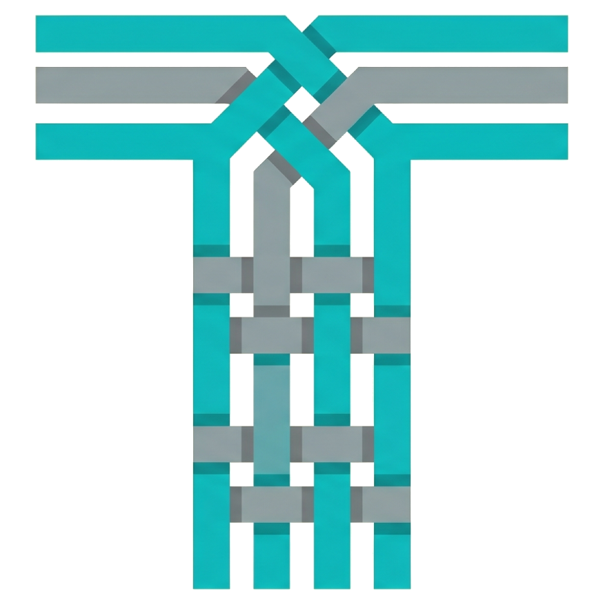

<div align="center">



# Tenun

**Bahasa pemrograman berkata kunci Bahasa Indonesia, dengan compiler yang ditulis dalam Zig.**

*Kode dijalin menjadi satu.*

[Dokumentasi](docs/BAHASA.md) · [Grammar](docs/GRAMMAR.md) · [Roadmap](docs/ROADMAP.md) · [Changelog](CHANGELOG.md) · [Releases](https://github.com/TenunLang/Tenun/releases)

</div>

---

```tenun
fungsi salam(nama: teks): kosong {
    cetak("Halo, " + nama);
}

biar angka: bulat = 10;

kalau angka > 5 {
    salam("Tenun");
} lain {
    cetak("kecil");
}

untuk i dari 1 sampai 4 {
    cetak(i);
}
```

## Filosofi

Tenun lahir dari satu pengamatan sederhana: hambatan terbesar bagi penutur Bahasa Indonesia yang mulai belajar memrogram bukanlah logika, melainkan **lapisan kosakata asing** yang menyelimuti setiap konsep. Sebelum memahami percabangan, pemula harus lebih dulu menghafal `if`; sebelum mengerti perulangan, ia berhadapan dengan `while` dan `for`. Tenun menghapus lapisan itu dengan menjadikan Bahasa Indonesia sebagai bahasa kata kunci yang utuh — `kalau`, `selama`, `untuk`, `fungsi`, `kembali` — sehingga niat program terbaca langsung dalam bahasa yang dipikirkan penggunanya.

Nama "Tenun" dipilih sebagai metafora: sebagaimana benang-benang dijalin menjadi kain yang utuh, baris-baris kode dirajut menjadi program yang padu. Metafora ini sekaligus menautkan bahasa pada warisan budaya Nusantara, menegaskan bahwa perkakas rekayasa perangkat lunak tak harus berakar pada satu tradisi linguistik saja.

Tiga prinsip desain menuntun seluruh keputusan teknis Tenun:

1. **Keterbacaan sebagai antarmuka utama.** Sintaks dirancang agar dapat dibaca nyaris seperti kalimat. Kurung kurawal dan titik koma dipertahankan demi kejelasan batas blok dan pernyataan, bukan ditiadakan demi keringkasan yang ambigu.

2. **Pengetikan statis demi keandalan dini.** Tenun memeriksa tipe pada saat kompilasi. Pilihan ini menukar sedikit keluwesan dengan jaminan: sekelas kesalahan terdeteksi sebelum program dijalankan, sehingga umpan balik tiba lebih awal — sifat yang bernilai baik bagi pembelajar maupun sistem produksi.

3. **Kesederhanaan yang tidak mengorbankan performa.** Bahasa yang ramah pemula kerap diasumsikan lambat. Tenun menolak premis itu. Melalui strategi backend bertingkat — interpreter untuk diagnosa, bytecode VM untuk eksekusi sehari-hari, dan kompilasi native untuk performa puncak — Tenun mempertahankan kesederhanaan permukaan tanpa menyerahkan kecepatan.

## Arsitektur

Compiler Tenun mengikuti pipeline searah yang klasik: setiap fase hanya bergantung pada keluaran fase sebelumnya, sehingga tiap tahap dapat diuji dan ditukar secara mandiri.

```
sumber (.tenun)
   │  lexer      teks  ->  token (beserta posisi baris/kolom)
   ▼
 token
   │  parser     token ->  AST (pohon sintaks abstrak)
   ▼
  AST
   │  sema       resolusi nama + pengecekan tipe
   ▼
AST tervalidasi
   │
   ├─ interp     tree-walking interpreter   (diagnosa)
   ├─ vm         bytecode + virtual machine (default)
   └─ codegen    transpilasi ke C -> native (tercepat)
   ▼
 hasil
```

Pemisahan tegas antara front end (lexer, parser, sema) dan back end (interp, vm, codegen) memungkinkan ketiga strategi eksekusi berbagi satu representasi semantik yang sama. Seluruh kesalahan — sintaksis maupun semantik — dikumpulkan melalui modul `diagnostics` yang menyimpan posisi dan pesan, alih-alih berhenti pada galat pertama.

## Sorotan

- **Kata kunci Bahasa Indonesia** yang lengkap: `biar`, `tetap`, `fungsi`, `kembali`, `kalau`, `lain`, `selama`, `untuk`, `cocok` (switch), `coba`/`tangkap` (try/catch), `henti`, `lanjut`.
- **Bertipe statis**: tipe dasar `bulat`, `desimal`, `teks`, `bool`, `kosong`; tipe komposit larik `[]T`, peta `peta`, dan `dinamis`.
- **Tiga backend eksekusi** dari satu sumber: interpreter, bytecode VM, dan native (transpilasi ke C).
- **Ekosistem modul** untuk web, basis data, kripto, surel, dan scraping (lihat di bawah).
- **Perkakas siap pakai**: REPL, formatter (`tenun fmt`), pengelola paket (`tenun add`), penjalan skrip (`tenun jalan`), serta ekstensi VSCode.

## Instalasi

Linux / macOS:

```
curl -fsSL https://raw.githubusercontent.com/TenunLang/Tenun/main/install.sh | bash
```

Windows (PowerShell):

```
irm https://raw.githubusercontent.com/TenunLang/Tenun/main/install.ps1 | iex
```

Skrip mengunduh binari rilis terbaru ke `~/.tenun/bin` dan menambahkannya ke PATH. Tersedia juga di halaman [Releases](https://github.com/TenunLang/Tenun/releases): paket `.deb` (Linux), installer `.exe` (Windows, NSIS), dan binari mentah Linux/macOS/Windows.

## Membangun dari sumber

Membutuhkan Zig 0.14.0.

```
zig build                          # bangun compiler ke zig-out/bin/tenun
zig build test                     # jalankan seluruh unit test
zig build -Doptimize=ReleaseFast   # build teroptimasi
```

## Penggunaan

```
tenun version                 menampilkan versi
tenun run <file>              menjalankan program (bytecode VM, default)
tenun run <file> --interp     menjalankan via tree-walking interpreter
tenun build <file>            kompilasi ke executable native (<file>.exe)
tenun build <file> --emit-c   simpan juga sumber C perantara
tenun fmt <file>              format ulang kode sumber
tenun repl                    sesi interaktif
tenun add <modul>             pasang modul dari registri
tenun jalan <skrip>           jalankan skrip yang didefinisikan di tenun.json
```

Contoh:

```
$ tenun run examples/hello.tenun
Halo, Tenun

$ tenun build examples/faktorial.tenun
[tenun] build sukses: examples/faktorial.exe
$ ./examples/faktorial.exe
120
```

## Performa

`tenun build` mentranspilasi program ke C lalu mengompilasinya dengan `zig cc -O2`, menghasilkan executable native. Perbandingan pada loop 50 juta iterasi (ReleaseFast):

| Backend | Waktu |
|---|---|
| Native (`tenun build`) | ~0.01 s |
| Bytecode VM (`tenun run`) | ~1.1 s |
| Interpreter (`--interp`) | ~2.7 s |

## Ekosistem modul

Pustaka resmi Tenun dikembangkan sebagai repositori terpisah dan dipasang melalui `tenun add <nama>`.

| Modul | Fungsi |
|---|---|
| `web` | Kerangka web: routing, middleware, CORS, berkas statis |
| `rute` | Pendefinisian rute HTTP |
| `tampilan` | Mesin templat tampilan |
| `sesi` | Manajemen sesi |
| `auth` | Autentikasi |
| `orm` | ORM dengan relasi (MySQL/Postgres) |
| `mysql`, `postgres` | Driver basis data relasional |
| `redis` | Klien Redis |
| `json` | Penguraian & penyusunan JSON |
| `mail` | SMTP/IMAP/Resend dengan TLS |
| `websocket`, `socketio` | Komunikasi dua arah waktu nyata |
| `jaring` | Klien HTTP + parser HTML/XML (axios + cheerio) untuk scraping |
| `os`, `proses`, `berkas` | Akses sistem operasi, proses, dan berkas |
| `larik` | Fungsi orde tinggi larik (map/filter/reduce) |

## Struktur proyek

```
TenunLang/
  src/
    main.zig          entry point CLI
    driver.zig        orkestrasi pipeline: sumber -> hasil
    lexer/            sumber -> token
    parser/           token -> AST
    sema/             resolusi nama + pengecekan tipe
    interp/           tree-walking interpreter
    vm/               bytecode + virtual machine
    codegen/          transpiler ke C (native)
    builtins/         fungsi bawaan (waktu, os, proses, berkas, kripto, dll.)
    diagnostics/      pelaporan kesalahan (baris, kolom, pesan)
  examples/           contoh program .tenun
  docs/               BAHASA.md, GRAMMAR.md, ROADMAP.md
  install.sh          pemasang Linux/macOS
  install.ps1         pemasang Windows
  build.zig           definisi build Zig
```

## Dokumentasi

- [docs/BAHASA.md](docs/BAHASA.md) — referensi bahasa untuk pengguna
- [docs/GRAMMAR.md](docs/GRAMMAR.md) — grammar formal (EBNF)
- [docs/ROADMAP.md](docs/ROADMAP.md) — rencana pengembangan
- [CHANGELOG.md](CHANGELOG.md) — riwayat perubahan

## Status

Inti bahasa telah lengkap: variabel/konstanta, seluruh tipe dasar dan komposit (larik, peta, dinamis), operator dengan precedence dan operator bitwise, percabangan (`kalau`/`lain`/`cocok`), perulangan (`selama`, `untuk`, for-each), penanganan galat (`coba`/`tangkap`), fungsi dengan rekursi dan nilai fungsi, serta pustaka builtin yang luas. Backend native (codegen C) telah berjalan, dilengkapi CI lintas-platform dan ekstensi VSCode. Pengembangan saat ini berfokus pada pematangan ekosistem modul dan pustaka standar.

## Kontribusi

Kontribusi dipersilakan melalui issue dan pull request di [github.com/TenunLang/Tenun](https://github.com/TenunLang/Tenun). Setiap penambahan fitur bahasa wajib disertai golden test dan pembaruan dokumentasi yang sinkron.

## Lisensi

Tenun dirilis di bawah [Lisensi MIT](LICENSE).

```
MIT License

Copyright (c) 2026 TenunLang

Izin diberikan, secara cuma-cuma, kepada siapa pun yang memperoleh salinan
perangkat lunak ini dan berkas dokumentasi terkait ("Perangkat Lunak"), untuk
menggunakan Perangkat Lunak tanpa batasan, termasuk namun tidak terbatas pada
hak untuk memakai, menyalin, memodifikasi, menggabungkan, menerbitkan,
mendistribusikan, mensublisensikan, dan/atau menjual salinan Perangkat Lunak,
serta mengizinkan orang yang menerima Perangkat Lunak untuk melakukan hal yang
sama, dengan syarat ketentuan berikut:

Pemberitahuan hak cipta di atas dan pemberitahuan izin ini harus disertakan
dalam semua salinan atau bagian penting dari Perangkat Lunak.

PERANGKAT LUNAK INI DISEDIAKAN "SEBAGAIMANA ADANYA", TANPA JAMINAN APA PUN.
```
